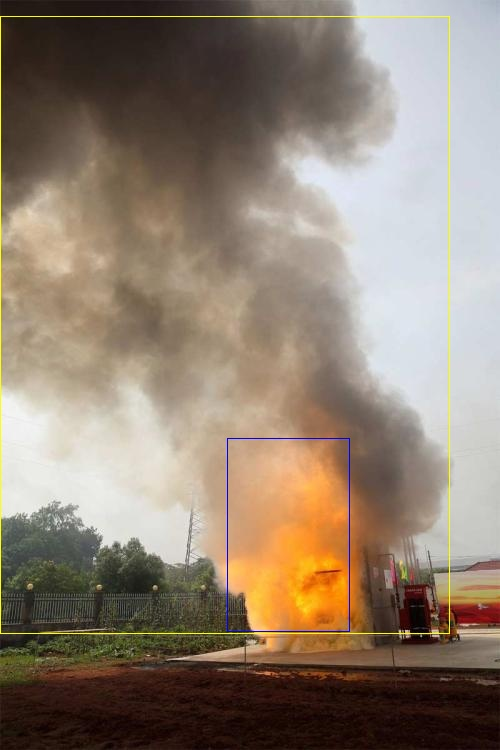
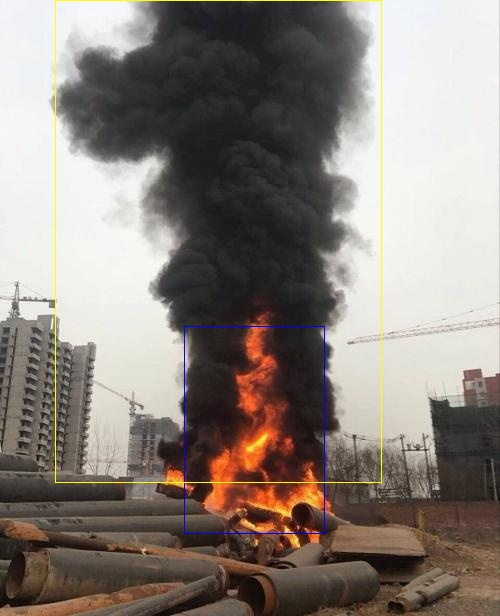
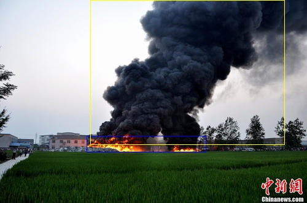

# yolov3_fire_detection
## part 1. Introduction

Implementation of YOLO v3 object detector in Tensorflow for Fire and Smoke detection. The full details are in [this paper](https://pjreddie.com/media/files/papers/YOLOv3.pdf).  In this project we cover several segments as follows:<br>
- [x] [YOLO v3 architecture](https://github.com/YunYang1994/tensorflow-yolov3/blob/master/core/yolov3.py)
- [x] [Training tensorflow-yolov3 with GIOU loss function](https://giou.stanford.edu/)
- [x] Basic working demo
- [x] Training pipeline
- [x] Detection result

YOLO paper is quick hard to understand, along side that paper. This repo enables you to have a quick understanding of YOLO Algorithmn.

## part2. Fire and Smoke detection demo

```bashrc
$ python demo.py
```

## part3. Train on your own dataset
Two files are required as follows:

- [`dataset.txt`](https://raw.githubusercontent.com/YunYang1994/tensorflow-yolov3/master/data/dataset/voc_train.txt): 

```
xxx/xxx.jpg 18.19,6.32,424.13,421.83,20 323.86,2.65,640.0,421.94,20 
xxx/xxx.jpg 48,240,195,371,11 8,12,352,498,14
# image_path x_min, y_min, x_max, y_max, class_id  x_min, y_min ,..., class_id 
```

- [`class.names`](https://github.com/YunYang1994/tensorflow-yolov3/blob/master/data/classes/coco.names):

```
fire
smoke
```

Then edit your `./core/config.py` to make some necessary configurations

```bashrc
__C.YOLO.CLASSES                = "./data/classes/Fire.names"
__C.TRAIN.ANNOT_PATH            = "./data/my_data/fire_train.txt"
__C.TEST.ANNOT_PATH             = "./data/my_data/fire_val.txt"
```
Here are two kinds of training method: 

##### (1) train from scratch:

```bashrc
$ python train.py
$ tensorboard --logdir ./data
```
##### (2) train from COCO weights(recommend):

```bashrc
$ cd checkpoint
$ wget https://github.com/YunYang1994/tensorflow-yolov3/releases/download/v1.0/yolov3_coco.tar.gz
$ tar -xvf yolov3_coco.tar.gz
$ cd ..
$ python convert_weight.py --train_from_coco
$ python train.py
```

#### how to test and evaluate it ?
```
$ python evaluate.py
$ cd mAP
$ python main.py -na
```

## part 4. Detection result






## part 5. Pre-train model
The pre-trained model can be download in [baidu pan](https://pan.baidu.com/s/1sdpFb4TCFuFRmZ0u1e39bg).
提取码：tvm6